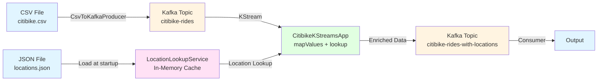
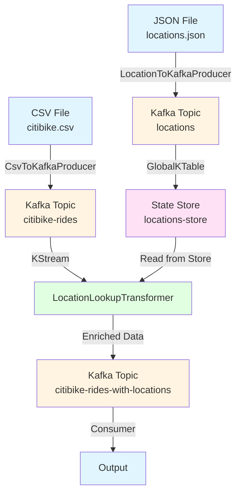

# Citibike Kafka Streams Application

A Java 21 Kafka Streams application that processes Citibike ride data and enriches it with geolocation information from a lookup table.

## Features

- Reads Citibike ride data from CSV files
- Publishes ride data to Kafka topics
- Enriches ride data with geolocation information using a JSON lookup table
- Outputs enriched data to Kafka topics
- Uses Kafka Streams for real-time stream processing

## Prerequisites

- **Java 21 or higher** (required - the project uses Java 21 features)
  - To check your Java version: `java -version`
  - To install Java 21 on macOS: `brew install openjdk@21` or download from [Oracle](https://www.oracle.com/java/technologies/downloads/#java21)
- Maven 3.6+
- Docker and Docker Compose (for running Kafka)
- Apache Kafka (runs via Docker Compose using KRaft mode - no Zookeeper needed)

## Project Structure

```
.
├── pom.xml                          # Maven build configuration
├── citibike.csv                     # Input CSV file with Citibike ride data
├── locations.json                   # Geolocation lookup table (JSON)
├── src/
│   ├── main/
│   │   ├── java/
│   │   │   └── com/citibike/kstreams/
│   │   │       ├── CitibikeKStreamsApp.java    # Main Kafka Streams application
│   │   │       ├── CsvToKafkaProducer.java     # CSV to Kafka producer
│   │   │       ├── model/                      # Data models
│   │   │       │   ├── CitibikeRide.java
│   │   │       │   ├── Location.java
│   │   │       │   └── RideWithLocation.java
│   │   │       └── service/
│   │   │           └── LocationLookupService.java
│   │   └── resources/
│   │       └── logback.xml
│   └── test/
│       ├── java/                    # Test classes
│       └── resources/               # Test data files
└── README.md
```

## Building the Project

```bash
mvn clean package
```

This will create a JAR file in the `target/` directory.

## Application Versions

The project includes two versions of the Kafka Streams application:

### Version 1: In-Memory Lookup (`CitibikeKStreamsApp`)
- Loads locations from JSON file into memory
- Uses in-memory cache for location lookups
- Simpler setup, faster for small datasets
- **Use when**: You have a small location dataset and want quick setup

### Version 2: KTable Lookup (`CitibikeKStreamsAppWithKTable`)
- Loads locations from a Kafka topic into a GlobalKTable
- Uses Kafka Streams state store for location lookups
- More scalable, follows Kafka-native patterns
- **Use when**: You want to update locations dynamically via Kafka topics, or have large datasets

## Topology Diagrams

### Version 1: In-Memory Lookup Topology



**Data Flow:**
1. `CsvToKafkaProducer` reads CSV file and publishes rides to `citibike-rides` topic
2. `CitibikeKStreamsApp` loads locations from JSON file into memory at startup
3. For each ride in the stream, the app looks up start/end locations from in-memory cache
4. Enriched rides are published to `citibike-rides-with-locations` topic

### Version 2: KTable Lookup Topology



**Data Flow:**
1. `LocationToKafkaProducer` reads JSON file and publishes locations to `locations` topic
2. `GlobalKTable` consumes from `locations` topic and materializes into `locations-store` state store
3. `CsvToKafkaProducer` reads CSV file and publishes rides to `citibike-rides` topic
4. `CitibikeKStreamsAppWithKTable` processes rides stream using `LocationLookupTransformer`
5. Transformer accesses `locations-store` to find closest locations for each ride
6. Enriched rides are published to `citibike-rides-with-locations` topic

**Key Differences:**
- Version 1: Locations loaded once at startup from file
- Version 2: Locations loaded from Kafka topic, can be updated dynamically
- Version 2: Uses Kafka Streams state store (fault-tolerant, scalable)

## Running the Application

### Version 1: In-Memory Lookup

### 1. Start Kafka

Start Kafka using Docker Compose (KRaft mode - no Zookeeper needed):

```bash
# Start Kafka and Kafka UI
docker-compose up -d

# Check that services are running
docker-compose ps

# View logs if needed
docker-compose logs -f kafka

# Stop services when done
docker-compose down

# To completely reset (clears all data)
docker-compose down -v
```

The Docker Compose setup includes:
- **Kafka** on port 9092 (using KRaft mode - no Zookeeper required)
- **Kafka UI** on port 8080 (web interface for managing topics and viewing messages)

You can access Kafka UI at http://localhost:8080 to view topics, messages, and manage your Kafka cluster.

### 2. Create Kafka Topics

Topics will be auto-created when you start producing messages, but you can also create them manually:

```bash
# Using Docker exec
docker exec -it kafka kafka-topics.sh --create --topic citibike-rides --bootstrap-server localhost:9092 --partitions 3 --replication-factor 1

docker exec -it kafka kafka-topics.sh --create --topic citibike-rides-with-locations --bootstrap-server localhost:9092 --partitions 3 --replication-factor 1

# Or use Kafka UI at http://localhost:8080 to create topics via the web interface
```

Alternatively, if you have Kafka installed locally:
```bash
kafka-topics.sh --create --topic citibike-rides --bootstrap-server localhost:9092 --partitions 3 --replication-factor 1
kafka-topics.sh --create --topic citibike-rides-with-locations --bootstrap-server localhost:9092 --partitions 3 --replication-factor 1
```

### 3. Produce CSV Data to Kafka

```bash
java -cp target/citibike-kstreams-1.0.0.jar com.citibike.kstreams.CsvToKafkaProducer citibike.csv
```

### 4. Run the Kafka Streams Application

```bash
java -cp target/citibike-kstreams-1.0.0.jar com.citibike.kstreams.CitibikeKStreamsApp locations.json
```

### 5. Consume Output

```bash
# Using Docker exec
docker exec -it kafka kafka-console-consumer.sh --topic citibike-rides-with-locations --from-beginning --bootstrap-server localhost:9092

# Or if you have Kafka installed locally
kafka-console-consumer.sh --topic citibike-rides-with-locations --from-beginning --bootstrap-server localhost:9092
```

You can also view messages in Kafka UI at http://localhost:8080 by navigating to the `citibike-rides-with-locations` topic.

### Version 2: KTable Lookup

### 1. Start Kafka

Same as Version 1 - start Kafka using Docker Compose.

### 2. Load Locations to Kafka Topic

First, publish locations to a Kafka topic:

```bash
java -cp target/citibike-kstreams-1.0.0.jar com.citibike.kstreams.LocationToKafkaProducer locations.json
```

This will create the `locations` topic and populate it with location data.

### 3. Produce CSV Data to Kafka

Same as Version 1:

```bash
java -cp target/citibike-kstreams-1.0.0.jar com.citibike.kstreams.CsvToKafkaProducer citibike.csv
```

### 4. Run the Kafka Streams Application with KTable

```bash
java -cp target/citibike-kstreams-1.0.0.jar com.citibike.kstreams.CitibikeKStreamsAppWithKTable
```

Note: This version doesn't need the locations.json file path as it reads from the Kafka topic.

### 5. Consume Output

Same as Version 1 - consume from the output topic.

## Data Format

### Input (Citibike CSV)
- `ride_id`: Unique ride identifier
- `rideable_type`: Type of bike (classic_bike, electric_bike)
- `started_at`, `ended_at`: Timestamps
- `start_station_name`, `end_station_name`: Station names
- `start_lat`, `start_lng`, `end_lat`, `end_lng`: Coordinates
- `member_casual`: Membership type

### Location Lookup (JSON)
Array of location objects with:
- `lat`, `lon`: Coordinates
- `display_name`: Human-readable location name
- `address`: Detailed address information

### Output (JSON)
Enriched ride data with:
- Original ride information
- `start_location`: Matched location for start coordinates
- `end_location`: Matched location for end coordinates

## Testing

Run tests with:

```bash
mvn test
```

## Configuration

The application uses the following Kafka topics:
- **Input**: `citibike-rides`
- **Output**: `citibike-rides-with-locations`

Kafka broker is configured to connect to `localhost:9092` by default. You can modify this in the code if needed.

## Location Matching

The application uses a distance-based matching algorithm (Haversine formula) to find the closest location within a threshold of approximately 1km from the ride coordinates.

## License

This project is for educational purposes.
