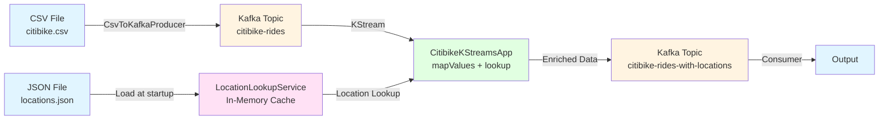
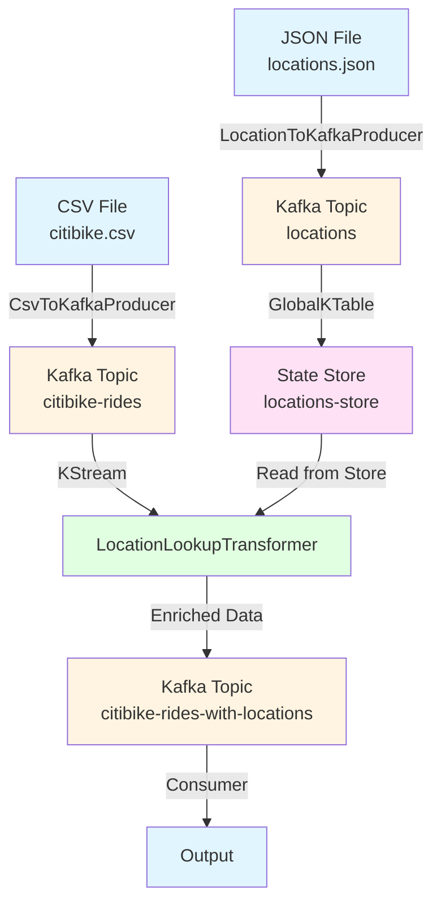

# Citibike Kafka Streams Application

A Java 21 Kafka Streams application that processes Citibike ride data and enriches it with geolocation information from a lookup table.

## Features

- Reads Citibike ride data from CSV files
- Publishes ride data to Kafka topics
- Enriches ride data with geolocation information using a JSON lookup table
- Outputs enriched data to Kafka topics
- Uses Kafka Streams for real-time stream processing
- Exposes Prometheus metrics for monitoring
- Pre-configured Grafana dashboard for visualization

## Prerequisites

- **Java 21 or higher** (required - the project uses Java 21 features)
  - To check your Java version: `java -version`
  - To install Java 21 on macOS: `brew install openjdk@21` or download from [Oracle](https://www.oracle.com/java/technologies/downloads/#java21)
- Maven 3.6+
- Docker and Docker Compose (for running Kafka, Prometheus, and Grafana)
- Apache Kafka (runs via Docker Compose using KRaft mode - no Zookeeper needed)

## Project Structure

```
.
├── pom.xml                          # Maven build configuration
├── citibike.csv                     # Input CSV file with Citibike ride data
├── locations.json                   # Geolocation lookup table (JSON)
├── docker-compose.yml               # Docker Compose configuration for Kafka, Prometheus, Grafana
├── prometheus.yml                   # Prometheus configuration
├── grafana/                         # Grafana dashboard and provisioning
│   ├── dashboards/
│   │   └── citibike-metrics.json    # Pre-configured Grafana dashboard
│   └── provisioning/
│       ├── datasources/
│       │   └── prometheus.yml       # Prometheus datasource config
│       └── dashboards/
│           └── dashboard.yml       # Dashboard provisioning config
├── src/
│   ├── main/
│   │   ├── java/
│   │   │   └── com/citibike/kstreams/
│   │   │       ├── CitibikeKStreamsApp.java           # Main Kafka Streams app (in-memory lookup)
│   │   │       ├── CitibikeKStreamsAppWithKTable.java # KTable-based Kafka Streams app
│   │   │       ├── CsvToKafkaProducer.java            # CSV to Kafka producer
│   │   │       ├── LocationToKafkaProducer.java       # Locations JSON to Kafka producer
│   │   │       ├── metrics/                            # Metrics and monitoring
│   │   │       │   ├── MetricsService.java
│   │   │       │   └── MetricsServer.java
│   │   │       ├── model/                              # Data models
│   │   │       │   ├── CitibikeRide.java
│   │   │       │   ├── Location.java
│   │   │       │   └── RideWithLocation.java
│   │   │       ├── service/
│   │   │       │   └── LocationLookupService.java
│   │   │       └── transformer/
│   │   │           └── LocationLookupTransformer.java
│   │   └── resources/
│   │       └── logback.xml
│   └── test/
│       ├── java/                    # Test classes
│       └── resources/               # Test data files
└── README.md
```

## Building the Project

```bash
mvn clean package
```

This will create a JAR file in the `target/` directory: `citibike-kstreams-1.0.0.jar` (includes all dependencies via Maven Shade plugin).

## Application Versions

The project includes two versions of the Kafka Streams application:

### Version 1: In-Memory Lookup (`CitibikeKStreamsApp`)
- Loads locations from JSON file into memory
- Uses in-memory cache for location lookups
- Simpler setup, faster for small datasets
- **Use when**: You have a small location dataset and want quick setup

### Version 2: KTable Lookup (`CitibikeKStreamsAppWithKTable`)
- Loads locations from a Kafka topic into a GlobalKTable
- Uses Kafka Streams state store for location lookups
- More scalable, follows Kafka-native patterns
- **Use when**: You want to update locations dynamically via Kafka topics, or have large datasets

## Topology Diagrams

### Version 1: In-Memory Lookup Topology



**Data Flow:**
1. `CsvToKafkaProducer` reads CSV file and publishes rides to `citibike-rides` topic
2. `CitibikeKStreamsApp` loads locations from JSON file into memory at startup
3. For each ride in the stream, the app looks up start/end locations from in-memory cache
4. Enriched rides are published to `citibike-rides-with-locations` topic

### Version 2: KTable Lookup Topology



**Data Flow:**
1. `LocationToKafkaProducer` reads JSON file and publishes locations to `locations` topic
2. `GlobalKTable` consumes from `locations` topic and materializes into `locations-store` state store
3. `CsvToKafkaProducer` reads CSV file and publishes rides to `citibike-rides` topic
4. `CitibikeKStreamsAppWithKTable` processes rides stream using `LocationLookupTransformer`
5. Transformer accesses `locations-store` to find closest locations for each ride
6. Enriched rides are published to `citibike-rides-with-locations` topic

**Key Differences:**
- Version 1: Locations loaded once at startup from file
- Version 2: Locations loaded from Kafka topic, can be updated dynamically
- Version 2: Uses Kafka Streams state store (fault-tolerant, scalable)

## Running the Application

### Step 1: Start Infrastructure Services

Start Kafka, Prometheus, and Grafana using Docker Compose:

```bash
# Start all services (Kafka, Kafka UI, Prometheus, Grafana)
docker-compose up -d

# Check that services are running
docker-compose ps

# View logs if needed
docker-compose logs -f kafka

# Stop services when done
docker-compose down

# To completely reset (clears all data)
docker-compose down -v
```

The Docker Compose setup includes:
- **Kafka** on port 9092 (using KRaft mode - no Zookeeper required)
- **Kafka UI** on port 8080 (web interface for managing topics and viewing messages)
- **Prometheus** on port 9090 (metrics collection)
- **Grafana** on port 3000 (metrics visualization)

You can access:
- Kafka UI at http://localhost:8080
- Prometheus at http://localhost:9090
- Grafana at http://localhost:3000 (default credentials: `admin` / `admin`)

### Step 2: Create Kafka Topics (Optional)

Topics will be auto-created when you start producing messages, but you can also create them manually:

```bash
# Using Docker exec
docker exec -it kafka kafka-topics.sh --create --topic citibike-rides --bootstrap-server localhost:9092 --partitions 3 --replication-factor 1

docker exec -it kafka kafka-topics.sh --create --topic citibike-rides-with-locations --bootstrap-server localhost:9092 --partitions 3 --replication-factor 1

docker exec -it kafka kafka-topics.sh --create --topic locations --bootstrap-server localhost:9092 --partitions 3 --replication-factor 1

# Or use Kafka UI at http://localhost:8080 to create topics via the web interface
```

### Version 1: In-Memory Lookup

#### Step 3: Produce CSV Data to Kafka

In a terminal, run:

```bash
java -cp target/citibike-kstreams-1.0.0.jar com.citibike.kstreams.CsvToKafkaProducer citibike.csv
```

This will:
- Read the CSV file and parse ride data
- Publish rides to the `citibike-rides` topic
- Start a metrics server on port 8081
- Track metrics for rides processed, parsed, and parse failures

**Note:** The producer will finish when all CSV data is processed. The metrics server will continue running.

#### Step 4: Run the Kafka Streams Application

In a **separate terminal**, run:

```bash
java -cp target/citibike-kstreams-1.0.0.jar com.citibike.kstreams.CitibikeKStreamsApp locations.json
```

This will:
- Load locations from `locations.json` into memory
- Start processing rides from the `citibike-rides` topic
- Enrich rides with location data
- Publish enriched rides to `citibike-rides-with-locations` topic
- Start a metrics server on port 8081 (if not already running)
- Track metrics for lookups, successful/failed lookups, and processing rates

**Note:** The application runs continuously. Press `Ctrl+C` to stop.

#### Step 5: View Output

You can view the enriched output in several ways:

**Option 1: Using Kafka Console Consumer**
```bash
# Using Docker exec
docker exec -it kafka kafka-console-consumer.sh --topic citibike-rides-with-locations --from-beginning --bootstrap-server localhost:9092

# Or if you have Kafka installed locally
kafka-console-consumer.sh --topic citibike-rides-with-locations --from-beginning --bootstrap-server localhost:9092
```

**Option 2: Using Kafka UI**
- Navigate to http://localhost:8080
- Select the `citibike-rides-with-locations` topic
- View messages in the web interface

**Option 3: View Metrics in Grafana**
- Navigate to http://localhost:3000
- Login with `admin` / `admin`
- The "Citibike Kafka Streams Metrics" dashboard will be automatically loaded
- View real-time metrics including lookup rates, success rates, and processing rates

### Version 2: KTable Lookup

#### Step 3: Load Locations to Kafka Topic

First, publish locations to a Kafka topic:

```bash
java -cp target/citibike-kstreams-1.0.0.jar com.citibike.kstreams.LocationToKafkaProducer locations.json
```

This will:
- Read locations from `locations.json`
- Publish locations to the `locations` topic
- Start a metrics server on port 8081
- Track the number of locations loaded

**Note:** Wait for this to complete before proceeding to the next step.

#### Step 4: Produce CSV Data to Kafka

In a terminal, run:

```bash
java -cp target/citibike-kstreams-1.0.0.jar com.citibike.kstreams.CsvToKafkaProducer citibike.csv
```

This publishes rides to the `citibike-rides` topic.

#### Step 5: Run the Kafka Streams Application with KTable

In a **separate terminal**, run:

```bash
java -cp target/citibike-kstreams-1.0.0.jar com.citibike.kstreams.CitibikeKStreamsAppWithKTable
```

This will:
- Load locations from the `locations` topic into a GlobalKTable
- Start processing rides from the `citibike-rides` topic
- Use the `LocationLookupTransformer` to enrich rides with location data
- Publish enriched rides to `citibike-rides-with-locations` topic
- Start a metrics server on port 8081
- Track metrics for lookups, successful/failed lookups, and processing rates

**Note:** The application runs continuously. Press `Ctrl+C` to stop.

#### Step 6: View Output

Same as Version 1 - use Kafka Console Consumer, Kafka UI, or Grafana to view the output.

## Data Format

### Input (Citibike CSV)
- `ride_id`: Unique ride identifier
- `rideable_type`: Type of bike (classic_bike, electric_bike)
- `started_at`, `ended_at`: Timestamps
- `start_station_name`, `end_station_name`: Station names
- `start_lat`, `start_lng`, `end_lat`, `end_lng`: Coordinates
- `member_casual`: Membership type

### Location Lookup (JSON)
Array of location objects with:
- `lat`, `lon`: Coordinates
- `display_name`: Human-readable location name
- `address`: Detailed address information

### Output (JSON)
Enriched ride data with:
- Original ride information
- `start_location`: Matched location for start coordinates
- `end_location`: Matched location for end coordinates

## Testing

Run all tests with:

```bash
mvn test
```

Run specific test suites:

```bash
# Run metrics tests
mvn test -Dtest="*Metrics*"

# Run CSV parsing tests
mvn test -Dtest="CsvToKafkaProducerTest"

# Run location lookup tests
mvn test -Dtest="LocationLookupServiceTest"
```

## Configuration

The application uses the following Kafka topics:
- **Input**: `citibike-rides`
- **Output**: `citibike-rides-with-locations`
- **Locations** (Version 2 only): `locations`

Kafka broker is configured to connect to `localhost:9092` by default. You can modify this in the code if needed.

## Location Matching

The application uses a distance-based matching algorithm (Haversine formula) to find the closest location within a threshold of approximately 1km from the ride coordinates.

## Metrics and Monitoring

The application exposes Prometheus metrics on port 8081 at `/metrics` endpoint. Metrics are automatically collected by Prometheus and visualized in Grafana.

### Available Metrics

- `citibike_locations_count` - Current number of locations loaded
- `citibike_rides_count` - Current number of rides
- `citibike_rides_processed_total` - Total number of rides processed
- `citibike_rides_parsed_total` - Total number of rides successfully parsed
- `citibike_rides_parse_failed_total` - Total number of rides that failed to parse
- `citibike_location_lookups_total` - Total number of location lookups attempted
- `citibike_location_lookups_successful_total` - Total number of successful location lookups
- `citibike_location_lookups_failed_total` - Total number of failed location lookups
- `citibike_location_lookup_duration_seconds` - Duration of location lookups (histogram with percentiles)

### Accessing Metrics

1. **Prometheus**: http://localhost:9090
   - Query metrics using PromQL
   - View targets to verify metrics collection
   - Example queries:
     - `rate(citibike_location_lookups_total[1m])` - Lookups per second
     - `citibike_rides_processed_total` - Total rides processed

2. **Grafana**: http://localhost:3000
   - Default credentials: `admin` / `admin`
   - Pre-configured dashboard: "Citibike Kafka Streams Metrics"
   - Dashboard includes:
     - Locations and rides counts
     - Lookup rates (per second)
     - Success vs failure rates
     - Parse failure rates
     - Lookup duration percentiles (50th, 95th)
     - Processing rates

3. **Direct Metrics Endpoint**: http://localhost:8081/metrics
   - Raw Prometheus format metrics
   - Available when any application component is running

### Starting Monitoring Stack

The monitoring stack (Prometheus and Grafana) is started automatically with:

```bash
docker-compose up -d
```

The Grafana dashboard will automatically load when you access the web interface at http://localhost:3000.

### Metrics Collection Flow

1. Application components (producers, stream processors) collect metrics via `MetricsService`
2. Metrics are exposed via HTTP server on port 8081 at `/metrics` endpoint
3. Prometheus scrapes metrics from `http://host.docker.internal:8081/metrics` every 15 seconds
4. Grafana queries Prometheus to display metrics in dashboards

**Note:** Make sure your application is running before Prometheus can collect metrics. If Prometheus shows "down" status, verify that:
- The application is running
- The metrics server is accessible on port 8081
- Prometheus can reach `host.docker.internal:8081` (works on macOS/Windows, may need IP on Linux)

## Troubleshooting

### Quick Verification

Run the verification script to check all components:

```bash
./verify-metrics.sh
```

This will check:
- Metrics endpoint accessibility
- Prometheus target status
- Prometheus query capability
- Grafana datasource configuration

### Application won't start
- Verify Java 21 is installed: `java -version`
- Check that Kafka is running: `docker-compose ps`
- Verify Kafka is accessible: `docker exec -it kafka kafka-broker-api-versions --bootstrap-server localhost:9092`

### No metrics in Grafana (but Prometheus has data)

This is usually a connectivity issue between Prometheus and the metrics endpoint. Follow these steps:

1. **Verify metrics endpoint is accessible from host:**
   ```bash
   curl http://localhost:8081/metrics
   ```
   You should see Prometheus-formatted metrics. If not, make sure your application is running.

2. **Check Prometheus can reach the endpoint:**
   - Open http://localhost:9090/targets
   - Look for the `citibike-app` target
   - Status should be "UP" (green)
   - If it's "DOWN" (red), Prometheus can't reach the metrics endpoint

3. **Fix Prometheus connectivity:**
   - The `prometheus.yml` uses `host.docker.internal:8081` to reach the host machine
   - This works on macOS and Windows Docker Desktop
   - **On Linux**, you may need to:
     - Find your host IP: `ip addr show docker0 | grep inet`
     - Update `prometheus.yml` to use the IP instead: `targets: ['172.17.0.1:8081']`
     - Or add to docker-compose.yml prometheus service:
       ```yaml
       extra_hosts:
         - "host.docker.internal:host-gateway"
       ```

4. **Reload Prometheus configuration:**
   ```bash
   # Restart Prometheus to pick up config changes
   docker-compose restart prometheus
   
   # Or send SIGHUP to reload config
   docker kill -s SIGHUP prometheus
   ```

5. **Verify Prometheus is scraping:**
   - Wait 15-30 seconds after starting the app
   - Check Prometheus targets: http://localhost:9090/targets
   - Query a metric in Prometheus: http://localhost:9090/graph?g0.expr=citibike_locations_count

6. **Check Grafana datasource:**
   - Open Grafana: http://localhost:3000
   - Go to Configuration → Data Sources
   - Verify Prometheus datasource is configured and shows "Success" when testing

7. **Verify dashboard queries:**
   - Open the dashboard in Grafana
   - Click on a panel → Edit
   - Check the query - it should match metric names from step 1
   - Try the query directly in Prometheus to verify it returns data

8. **Use the verification script:**
   ```bash
   ./verify-metrics.sh
   ```
   This script checks all components and provides troubleshooting tips.

### Topics not created
- Topics are auto-created by default (KAFKA_AUTO_CREATE_TOPICS_ENABLE: 'true')
- You can manually create topics using Kafka UI or `kafka-topics.sh`

### Port conflicts
- Kafka: 9092, 9093
- Kafka UI: 8080
- Prometheus: 9090
- Grafana: 3000
- Metrics Server: 8081

If any port is in use, modify `docker-compose.yml` or the application code.

## License

This project is for educational purposes.
